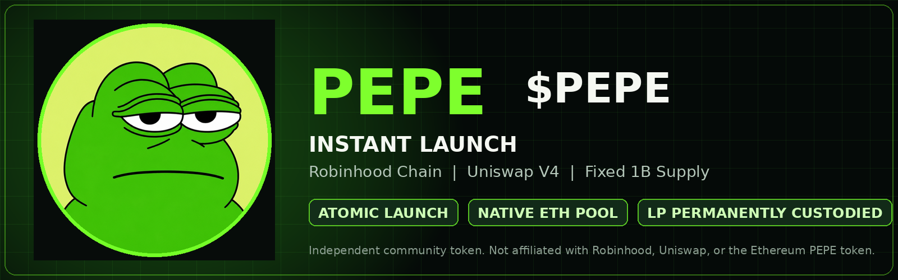

<p align="center">
  
</p>

<h1 align="center">PEPE · $PEPE</h1>
<p align="center"><strong>Guarded, one-transaction Uniswap V4 Instant Launch on Robinhood Chain.</strong></p>

<p align="center">
  
  
  
  
</p>

## What this repository launches

One atomic `LiquidityLauncher.multicall`:

```text
createToken()
  └─ creates 1,000,000,000 PEPE through the canonical UERC20 factory

distributeToken()
  ├─ initializes a native ETH/PEPE Uniswap V4 pool
  ├─ deposits the full PEPE supply as single-sided liquidity
  ├─ places the LP NFT in the canonical FeeSplitter permanently
  └─ mints the creator-fee beneficiary NFT to the selected address
```

The launch wallet contributes **zero ETH as liquidity**. It needs native ETH only for transaction gas. Buyers bring ETH into the pool when purchasing PEPE.

## Fixed launch configuration

| Setting | Value |
|---|---|
| Network | Robinhood Chain, chain ID `4663` |
| Token | `PEPE` / `PEPE` |
| Supply | `1,000,000,000` PEPE |
| Decimals | `18` |
| Pool | Native ETH / PEPE, Uniswap V4 |
| LP fee | `0.25%` |
| Tick spacing | `60` |
| Hooks | None |
| Initial tick | `198060` |
| Position range | `-208980` to `198060` |
| LP custody | Canonical FeeSplitter |
| Creator fee | 40% of ETH-side LP fees; 0% of token-side fees |

This is the same Instant Launch structure reconstructed from FRONG’s launch transaction. See [the reconstruction notes](docs/FRONG_RECONSTRUCTION.md).

## Security model

The repository is designed to be public without exposing wallet secrets:

- `.env.example` contains no key or mnemonic.
- `.env`, key files, keystores, logs, and local deployment records are git-ignored.
- `npm run check` scans committed text files for credential assignments.
- The direct dependency is pinned to an exact version; commit the generated `package-lock.json` after your first local `npm install`.
- Every run checks chain ID and bytecode at all canonical contract addresses.
- The strategy’s launcher, FeeSplitter, BeneficiaryVault, and initial tick are verified on-chain.
- Broadcast requires a successful simulation, a funded wallet, `ALLOW_MAINNET_BROADCAST=YES`, and the phrase `DEPLOY PEPE`.
- The chain state is simulated again immediately before sending.

Read [SECURITY.md](SECURITY.md) before placing any private key in a local environment file.

## Repository setup

Requirements:

- Node.js 20 or 22
- Native ETH on Robinhood Chain for gas
- A fresh deployment wallet for the live transaction

```powershell
npm install
Copy-Item .env.example .env
notepad .env
```

For inspection and simulation, use only your **public address**:

```env
DEPLOYER_ADDRESS=0xYourPublicWalletAddress
PRIVATE_KEY=
ALLOW_MAINNET_BROADCAST=
```

For the live launch, remove `DEPLOYER_ADDRESS` or leave it matching the key, then set locally:

```env
PRIVATE_KEY=0xYourFreshWalletPrivateKey
ALLOW_MAINNET_BROADCAST=YES
```

Never commit or upload `.env`.

The included image metadata is already set to:

```env
IMAGE=ipfs://bafybeigdh33x7x4uoksihpevvewetrf6a46jjze2e7hvssadh4nittlmwy
```

Leaving `FEE_BENEFICIARY=` blank uses the deployment wallet.

## Safe launch sequence

Run local and repository checks:

```powershell
npm run check
```

Verify the canonical contracts and deterministic token address:

```powershell
npm run inspect
```

Simulate the complete atomic transaction without broadcasting:

```powershell
npm run simulate
```

Review the chain ID, deployer, fee beneficiary, predicted token address, gas estimate, and generated simulation JSON.

Broadcast only after all checks pass:

```powershell
npm run launch
```

The command requires typing exactly:

```text
DEPLOY PEPE
```

More detail is in [docs/DEPLOYMENT.md](docs/DEPLOYMENT.md).

## Publish to GitHub

Create an empty GitHub repository, then run:

```powershell
.\publish-github.ps1 -RepositoryUrl https://github.com/YOUR_ACCOUNT/pepe-robinhood-instant-launch.git
```

The publisher runs installation and checks, creates `package-lock.json`, initializes git, refuses to stage common secret files, commits, and pushes `main`. Authentication is handled by your normal Git credential manager; the script does not accept or store a GitHub token.

## After launch

The terminal prints and records:

- Transaction hash
- PEPE contract address
- Uniswap V4 pool ID
- Permanently custodied LP token ID
- Fee-beneficiary NFT ID and owner
- Verified token metadata and total supply

Follow [docs/VERIFY.md](docs/VERIFY.md) to validate the explorer record and pool events.

## Creator fee commands

After a confirmed launch, the deployment JSON supplies the LP/beneficiary token ID automatically:

```powershell
npm run fees
npm run collect
npm run claim
```

`fees` is read-only. `collect` harvests LP fees into the configured split destinations. `claim` withdraws the creator allocation from BeneficiaryVault to the current beneficiary NFT owner. The combined helper sends two sequential transactions:

```powershell
npm run collect-and-claim
```

See [docs/FEES.md](docs/FEES.md) for token-ID recovery, transaction safeguards, and the distinction between unharvested and claimable fees.

## Important limitations

- This repository does not guarantee Dexscreener, GeckoTerminal, wallet, or exchange indexing.
- The launch creates a **native ETH V4 pool**, not a WETH V3 pool.
- The original LP position is not withdrawable by the deployment wallet.
- The beneficiary NFT represents configured fee rights; it is not the LP NFT.
- The transaction is irreversible once confirmed.
- A ticker and artwork do not establish affiliation with another PEPE project.

## Project files

```text
.
├── .github/                 GitHub Actions and Dependabot
├── assets/                  Logo, banner, social preview
├── deployments/             Local records are ignored; .gitkeep only
├── docs/                    Contracts, deployment, verification, reconstruction
├── scripts/secret-scan.mjs  Repository secret guard
├── test/                    Offline repository safety tests
├── .env.example             Public, credential-free configuration template
├── launch-pepe.mjs          Inspect, simulate, and broadcast launcher
├── fees-pepe.mjs            Read, collect, and claim creator fees
├── SECURITY.md              Key handling and reporting policy
└── README.md
```

## Branding and affiliation

This is an independent community-token project. It is not affiliated with or endorsed by Robinhood, Uniswap Labs, the Uniswap Foundation, or the existing Ethereum PEPE token project. See [NOTICE.md](NOTICE.md).
